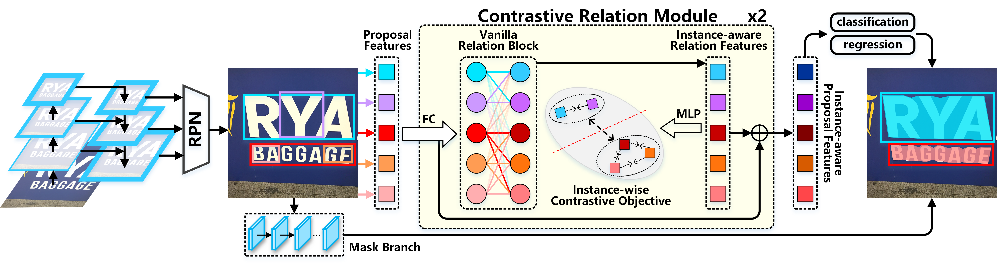

# CORE-Text: Improving Scene Text Detection with Contrastive Relational Reasoning

This repository is the official [PyTorch](https://pytorch.org/) implementation of [CORE-Text](https://ieeexplore.ieee.org/abstract/document/9428457), and contains demo training and evaluation scripts.




## Requirements
- [mmdetection](https://github.com/open-mmlab/mmdetection) == 2.13.0
- [mmcv](https://github.com/open-mmlab/mmdetection) == 1.3.5
- [pyclipper](https://pypi.org/project/pyclipper/) == 1.3.0


## Training Demo

### Base (Mask R-CNN)
To train Base ([Mask R-CNN](https://arxiv.org/abs/1703.06870)) on a single node with 4 gpus, run:
```shell
#!/usr/bin/env bash

GPUS=4
PORT=${PORT:-29500}
PYTHON=${PYTHON:-"python"}

CONFIG=configs/icdar2017mlt/base.py
WORK_DIR=work_dirs/mask_rcnn_r50_fpn_train_base

$PYTHON -m torch.distributed.launch --nproc_per_node=$GPUS \
                                    --nnodes=1 --node_rank=0 --master_addr="localhost" \
                                    --master_port=$PORT \
                                    tools/train.py \
                                    $CONFIG \
                                    --no-validate \
                                    --launcher pytorch \
                                    --work-dir ${WORK_DIR} \
                                    --seed 0
```

### VRM
To train [VRM](https://arxiv.org/abs/1711.11575) on a single node with 4 gpus, run:
```shell
#!/usr/bin/env bash

GPUS=4
PORT=${PORT:-29500}
PYTHON=${PYTHON:-"python"}

CONFIG=configs/icdar2017mlt/vrm.py
WORK_DIR=work_dirs/mask_rcnn_r50_fpn_train_vrm

$PYTHON -m torch.distributed.launch --nproc_per_node=$GPUS \
                                    --nnodes=1 --node_rank=0 --master_addr="localhost" \
                                    --master_port=$PORT \
                                    tools/train.py \
                                    $CONFIG \
                                    --no-validate \
                                    --launcher pytorch \
                                    --work-dir ${WORK_DIR} \
                                    --seed 0
```


### CORE
To train **CORE (ours)** on a single node with 4 gpus, run:
```shell
#!/usr/bin/env bash

GPUS=4
PORT=${PORT:-29500}
PYTHON=${PYTHON:-"python"}

# pre-training
CONFIG=configs/icdar2017mlt/core_pretrain.py
WORK_DIR=work_dirs/mask_rcnn_r50_fpn_train_core_pretrain

$PYTHON -m torch.distributed.launch --nproc_per_node=$GPUS \
                                    --nnodes=1 --node_rank=0 --master_addr="localhost" \
                                    --master_port=$PORT \
                                    tools/train.py \
                                    $CONFIG \
                                    --no-validate \
                                    --launcher pytorch \
                                    --work-dir ${WORK_DIR} \
                                    --seed 0

# training
CONFIG=configs/icdar2017mlt/core.py
WORK_DIR=work_dirs/mask_rcnn_r50_fpn_train_core

$PYTHON -m torch.distributed.launch --nproc_per_node=$GPUS \
                                    --nnodes=1 --node_rank=0 --master_addr="localhost" \
                                    --master_port=$PORT \
                                    tools/train.py \
                                    $CONFIG \
                                    --no-validate \
                                    --launcher pytorch \
                                    --work-dir ${WORK_DIR} \
                                    --seed 0
```

## Evaluation Demo
```shell
GPUS=4
PORT=${PORT:-29500}
CONFIG=path/to/config
CHECKPOINT=path/to/checkpoint

python -m torch.distributed.launch --nproc_per_node=$GPUS --master_port=$PORT \
    ./tools/test.py $CONFIG $CHECKPOINT --launcher pytorch \
    --eval segm \
    --not-encode-mask \
    --eval-options "jsonfile_prefix=path/to/work_dir/results/eval" "gt_path=data/icdar2017mlt/icdar2017mlt_gt.zip"
```

## Dataset Format
The structure of the dataset directory is shown as following, and we provide the COCO-format label ([ICDAR2017_train.json](https://www.dropbox.com/s/p4tysnxdy4570pg/ICDAR2017_train.json?dl=0)
 and [ICDAR2017_val.json](https://www.dropbox.com/s/f357jtm650tob7z/ICDAR2017_val.json?dl=0)) and the ground truth zipfile ([icdar2017mlt_gt.zip](https://www.dropbox.com/s/j0bhdmzrvmsfnr4/icdar2017mlt_gt.zip?dl=0)) for training and evaluation.
```shell
data
└── icdar2017mlt
    ├── annotations
    |   ├── ICDAR2017_train.json
    |   └── ICDAR2017_val.json
    ├── icdar2017mlt_gt.zip
    └── image
         ├── train
         └── val

```

## Results
Our model achieves the following performance on [ICDAR 2017 MLT](https://vision.cornell.edu/se3/wp-content/uploads/2019/01/ICDAR2017b.pdf) *val* set. Note that the results are slightly different (~0.1%) from what we reported in the paper, because we reimplement the code based on the open-source [mmdetection](https://github.com/open-mmlab/mmdetection).


|                        Method                      | Backbone |      Training set     |      Test set      |   Hmean   | Precision |   Recall  |                                                                                                     Download                                                         |
| :------------------------------------------------: | :------: | :-------------------: | :----------------: | :-------: | :-------: | :-------: | :------------------------------------------------------------------------------------------------------------------------------------------------------------------: |
| [Base](/configs/icdar2017mlt/base.py) (Mask R-CNN) | ResNet50 |  ICDAR 2017 MLT Train | ICDAR 2017 MLT Val |   0.800   |   0.828   |   0.773   |     [model](https://www.dropbox.com/s/ktthj4jzj5zrlth/base-af44a5a3.pth?dl=0) &#124; [log](https://www.dropbox.com/s/sgfdwjmacwgy1y7/base-af44a5a3.log.json?dl=0)    |
| [VRM](/configs/icdar2017mlt/vrm.py)                | ResNet50 |  ICDAR 2017 MLT Train | ICDAR 2017 MLT Val |   0.812   |   0.853   |   0.774   |     [model](https://www.dropbox.com/s/m3w6a61r2rqzdvl/vrm-2d0d97a8.pth?dl=0)  &#124; [log](https://www.dropbox.com/s/iooi1v6cd6gkn2w/vrm-2d0d97a8.log.json?dl=0)     |
| [CORE](/configs/icdar2017mlt/core.py) **(ours)**   | ResNet50 |  ICDAR 2017 MLT Train | ICDAR 2017 MLT Val | **0.821** | **0.872** | **0.777** |     [model](https://www.dropbox.com/s/1vaocayq9lof2w7/core-094f4428.pth?dl=0) &#124; [log](https://www.dropbox.com/s/vdbf33623dafj84/core-094f4428.log.json?dl=0)    |

## Citation
```bibtex
@inproceedings{9428457,
  author={Lin, Jingyang and Pan, Yingwei and Lai, Rongfeng and Yang, Xuehang and Chao, Hongyang and Yao, Ting},
  booktitle={2021 IEEE International Conference on Multimedia and Expo (ICME)},
  title={Core-Text: Improving Scene Text Detection with Contrastive Relational Reasoning},
  year={2021},
  pages={1-6},
  doi={10.1109/ICME51207.2021.9428457}
}
```